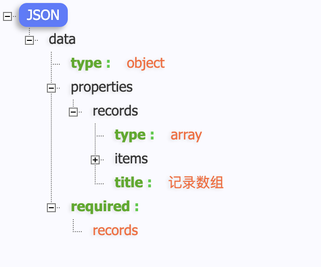

# yapi-json-model
根据yapi生成的json自动转换为model对象

# 如何获取正确的json字符串
json字符串的第一层只能有一个字段，这样才能正确获取到其名称，生成第一级的model对象
### 正确的json字符串
```
{"data":{"type":"object","properties":{"records":{"type":"array","items":{"type":"object","properties":{"name":{"type":"string","title":"名称"},"value":{"type":"number","title":"值"}},"required":["name","value"]},"title":"记录数组"}},"required":["records"]}},
```

### 错误的json字符串
```
{"data":{"type":"object","properties":{"records":{"type":"array","items":{"type":"object","properties":{"name":{"type":"string","title":"名称"},"value":{"type":"number","title":"值"}},"required":["name","value"]},"title":"记录数组"}},"required":["records"]},"total":{"type":"number","title":"总数"}}
```


# 如何自动生成对应的model对象
### Json Model All

### Json Model Select

